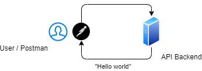

# Проектирование и разработка распределенных программных систем

Лекции и материалы по курсу распределенных систем в ЧелГУ, группа ПрИ-401.

## Лекции

### Лекция 1. Введение в распределенные системы

[Презентация](https://docs.google.com/presentation/d/1dKzu38tkdH4NswpoA1xSHBgD2CTQ2E-mPTfmwF19GV0/edit?usp=sharing)

**Ссылки**
1. Мартин Клеппман. Высоконагруженные приложения. Программирование, масштабирование, поддержка
2. [Distributed systems for fun and profit](http://book.mixu.net/distsys/)
3. [Страх и ненависть в распределённых системах](https://habr.com/ru/post/322876/)

### Лекция 2. Асинхронное программирование

[Презентация](https://docs.google.com/presentation/d/1rhkH8aMvMeT8BKP66jPAsK6xILwTX-SD_hGHxOZwwxI/edit?usp=sharing)

**Ссылки**
1. [Highload++ для начинающих](http://highload.guide/blog/highload-for-beginners.html)
2. [Анатомия веб-сервиса](http://highload.guide/blog/inside-webserver.html)

### Лекция 3. Модели данных

[Презентация](https://docs.google.com/presentation/d/1kFSOd4dU5wlFysUVzW85R9MLSkXaueEwIpNOqkhw7WM/edit?usp=sharing)

**Ссылки**
1. [NoSQL – коротко о главном](http://highload.guide/blog/NoSQL-quick-facts.html)
2. Мартин Клеппман. Высоконагруженные приложения. Программирование, масштабирование, поддержка. Глава 2

### Лекция 4. Коммуникация приложений

[Презентация](https://docs.google.com/presentation/d/1uculh-tzuiqvp36jI3Do-Ii4oC7PeU1ERTZnZ_jWUlc/edit?usp=sharing)

**Ссылки**
1. Хоп Грегор, Вульф Бобби. Шаблоны интеграции корпоративных приложений
2. Сэм Ньюмен. Создание микросервисов, глава 4

### Лекция 5. Очереди сообщений

[Презентация](https://docs.google.com/presentation/d/18Y-rkn9rK3tW-iq-vkyui7iv12CnS0t0FYe_B9OoqEI/edit?usp=sharing)

**Ссылки**
1. [Принципы и приёмы обработки очередей](http://highload.guide/blog/principles-and-methods-of-queuing.html)
2. [101 способ приготовления RabbitMQ и немного о pipeline архитектуре](http://highload.guide/blog/101-RabbitMQ-way-of-cooking.html)
3. [Очереди и блокировки. Теория и практика](http://highload.guide/blog/queues-and-lock.html)

### Лекция 6. Горизонтальное масштабирование

[Презентация](https://docs.google.com/presentation/d/14f9pJC6vX-W3nvg0BMsWQAjZqJ1Y2R5PRZeVM6BJ97c/edit?usp=sharing)

**Ссылки**
1. [Общая логика масштабирования](http://highload.guide/blog/scaling-logic.html)
2. [Масштабирование бэкенда](https://xakep.ru/2012/11/30/backend-zoom/)
3. [Горизонтальное масштабирование. Что, зачем, когда и как](http://highload.guide/blog/scaling-what-why-when-and-how.html)
4. [Как мы сделали ровную балансировку нагрузки на фронтенд-кластере](http://highload.guide/blog/load-balancing-frontend-cluster.html)

### Лекция 7. Кэширование

[Презентация](https://docs.google.com/presentation/d/1vPHpahFvAdmUcM94zrQS99h3kH4_Qw-jxkY9vIIu83c/edit?usp=sharing)

**Ссылки**
1. [Web, кэширование и memcached](http://highload.guide/blog/web-caching-memcached.html)
2. [Кэширование данных в web приложениях. Использование memcached](http://highload.guide/blog/caching-data-in-web-applications.html)
3. [Использование memcached и Redis в высоконагруженных проектах](http://highload.guide/blog/using-memcached-and-redis.html)

### Лекция 8. Масштабирование БД

[Презентация](https://docs.google.com/presentation/d/1ussOGD0R6oJV2j9PAViYyB3g53OgTEbJA0MeKwVpOVY/edit?usp=sharing)

**Ссылки**
1. Мартин Клеппман. Высоконагруженные приложения. Программирование, масштабирование, поддержка. Главы 5, 6
2. [Шардинг: паттерны и антипаттерны](https://habr.com/ru/company/oleg-bunin/blog/313366/)

## Практика

### Практика 1. Контейнеризация и Docker

[Презентация](https://docs.google.com/presentation/d/1jhSh3OhNGEcsuPn_a_NQsS6R1bnwO4x_S7JjWACNizk/edit?usp=sharing)

**Задание**
1. Написать  веб-сервер, который принимает HTTP-запрос и отдает ответ «Hello world»
2. Установить Docker
3. Написать Dockerfile и запустить веб-сервер в докер-контейнере так, чтобы к нему можно было обратиться с хост-машины

**Ссылки**
1. [Установка Docker](https://docs.docker.com/get-docker/)
2. [Документация по Docker](https://docs.docker.com/get-started/)
3. [Документация по Dockerfile](https://docs.docker.com/engine/reference/builder/)

### Практика 2. Взаимодействие контейнеров

[Презентация](https://docs.google.com/presentation/d/1VHCKm0d5Qjuivb6XH6Qk7n5rZlbwin_taiLNCn5vk9s/edit?usp=sharing)

**Задание**
1. Дописать приложение, чтобы оно содержало два эндпоинта
  * POST /links — сохраняет ссылку в БД и возвращает ее id
  * GET /links/<id> — отдает ссылку из БД по id
2. Добавить контейнер с PostgreSQL и настроить его взаимодействие с приложением
3. Настроить запуск обоих контейнеров через Docker Compose

**Ссылки**
1. [Postgres по Docker Hub](https://hub.docker.com/_/postgres)
2. [Сеть в Docker](https://docs.docker.com/network/network-tutorial-standalone/)
3. [Volumes в Docker](https://docs.docker.com/storage/volumes/)
4. [Docker Compose](https://docs.docker.com/compose/)
5. [Документация по docker-compose.yml](https://docs.docker.com/compose/compose-file/)

### Практика 3. Работа с RabbitMQ

[Презентация](https://docs.google.com/presentation/d/1-4KNodiYQ3itf1te0bjhpxW2AImLBqcOayHXv8Tkx2Q/edit?usp=sharing)

**Задание**
1. Добавить контейнер с RabbitMQ
2. В приложении добавить в модель ссылки поле «статус», добавить эндпоинт PUT /links/<id> для обновления статуса ссылки. При добавлении ссылки отправлять ее в очередь сообщений
3. Добавить консьюмер, который слушает очередь сообщений и получает все новые ссылки, делает запрос к ним и сохраняет HTTP-статус ответа через новый эндпоинт приложения. 

**Ссылки**
1. [RabbitMQ на Docker Hub](https://hub.docker.com/_/rabbitmq)
2. [Тьюториал по RabbitMQ](https://www.rabbitmq.com/getstarted.html)
3. [Healthchecks в docker-compose](https://stackoverflow.com/questions/31746182/docker-compose-wait-for-container-x-before-starting-y )

### Практика 4. Балансировка нагрузки через nginx

[Презентация](https://docs.google.com/presentation/d/1Dr5ghz8pnxfEkmM7I0adhxvMOl_8ScvedbgvDGYBXsk/edit?usp=sharing)

**Задание**
1. Поднять два отдельных контейнера с API. Каждый из них должен добавлять в ответ собственную метку, чтобы было понятно, какой из контейнеров ответил (например, через HTTP-хедер)
2. Поднять контейнер с nginx, который проксирует запросы на API-контейнеры и балансирует нагрузку между ними

**Ссылки**
1. [nginx на Docker Hub](https://hub.docker.com/_/nginx)
2. [Документация по nginx](http://nginx.org/ru/docs/beginners_guide.html)
3. [Балансировка нагрузки в nginx](http://nginx.org/en/docs/http/load_balancing.html)

### Практика 5. Кэширование в Redis

[Презентация](https://docs.google.com/presentation/d/1ZPnZc79EihqpX_904Sgq_K3Sq2ZPvglVQg2DVMfkKdc/edit?usp=sharing)

**Задание**
1. Добавить контейнер с Redis
2. Добавить в коде консьюмера использование Redis в качестве кэша для ответов от внешних сервисов

**Ссылки**
1. [Redis на Docker Hub](https://hub.docker.com/_/redis)
2. [Документация по Redis (введение)](https://redis.io/topics/data-types-intro)

